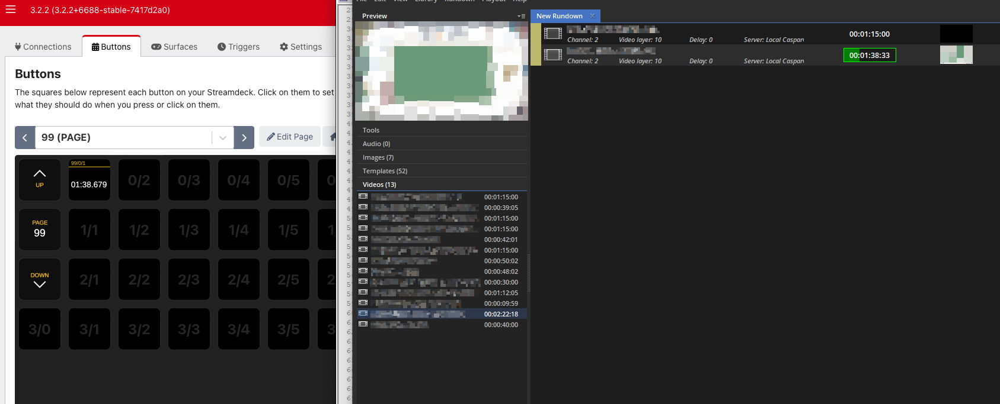
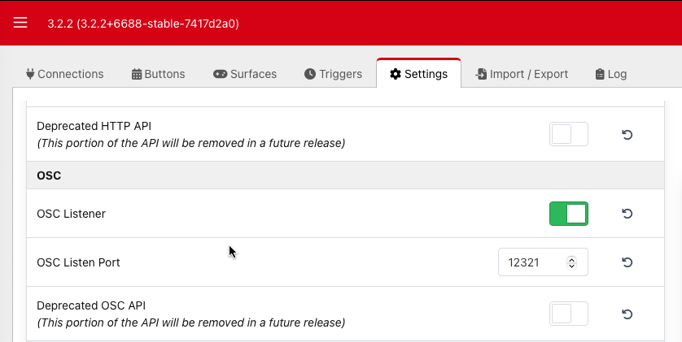
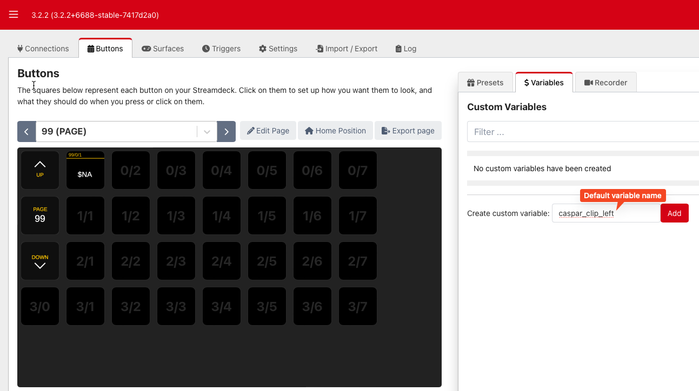
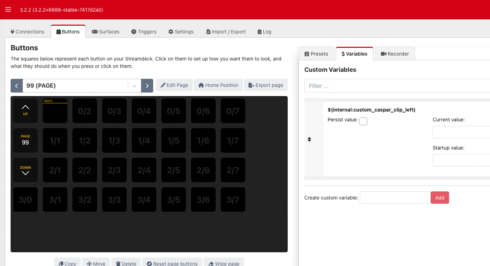
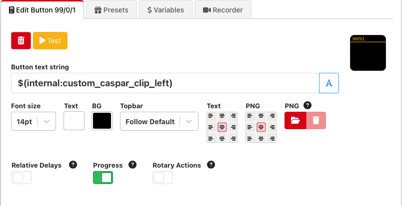

# CasparCG Companion Countdown

[](https://raw.githubusercontent.com/getninjan/ccg-companion-countdown/main/LICENSE)

## Introduction
This is a NodeJS script that receives clip data over OSC from CasparCG Server and relays a countdown timecode to a [Bitfocus Companion](https://bitfocus.io/companion) custom variable.

The code is **HEAVILY** inspired by, some might say copied from [ccg-bitc](https://github.com/GuildTV/ccg-bitc). :heart:



## Configuration
### CasparCG
CasparCG needs to be set to output OSC to the machine running the script e.g. `192.168.0.69`. If it's the same machine as the CasparCG Server is running on it's `127.0.0.1`.

```xml
<osc>
  <predefined-clients>
    <predefined-client>
      <address>127.0.0.1</address>
      <port>5254</port>
    </predefined-client>
  </predefined-clients>
</osc>
```

### Bitfocus Companion
Activate `OSC Listener` in `Settings` and set the port you want Companion to listen on.


It's a good idea to create the custom variable as well.





Then all that's left is to create a button with the `Button text string` set to `$(internal:custom_caspar_clip_left)`




## Usage
```bash
$ git clone git@github.com:getninjaN/ccg-companion-countdown.git
```
```bash
$ cd ccg-companion-countdown && npm install
```
```bash
$ npm run start
```
OR
```bash
$ node index.mjs
```

### Options
With the help of [Inquirer.js](https://github.com/SBoudrias/Inquirer.js) the configuration process is pretty straight forward. Run the script and follow the prompts.

These are the prompts:

| Prompt | Default | Description |
|-|-|-|
| OSC Port | 5254 | OSC port to listen on |
| CasparCG Server Source Channel | 2 | The clip channel to monitor |
| CasparCG Server Source Layer | 10 | The clip layer to monitor |
| Bitfocus Companion IP | 0.0.0.0 | IP address of Companion host |
| Bitfocus Companion OSC Port | 12321 | OSC port in Companion |
| Bitfocus Companion Custom Variable | caspar_clip_left | Custom variable name in Companion |

**Right now these aren't saved, so when the script stops running you have to enter them again next time you run it**

## Known issues
| Severity | Description |
|:-:|-|
| <span style="color: green;">Low</span> | The text "Empty" can sometimes appear during countdown. |

## Contributing
Pull requests are welcome.